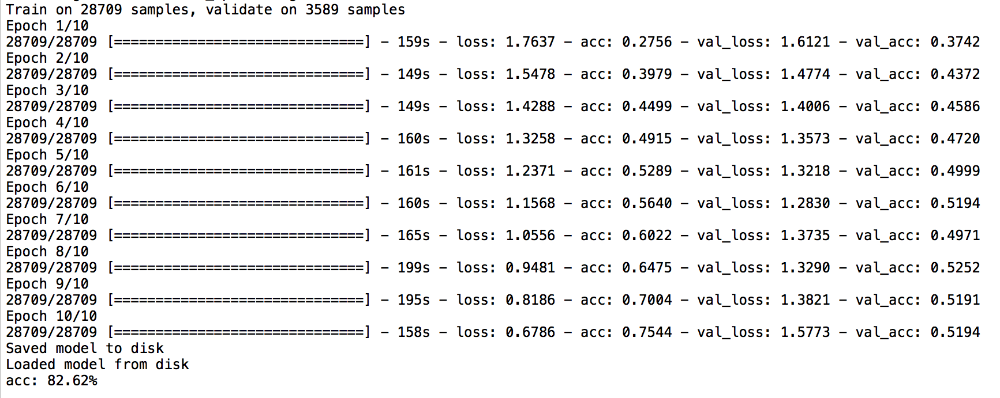
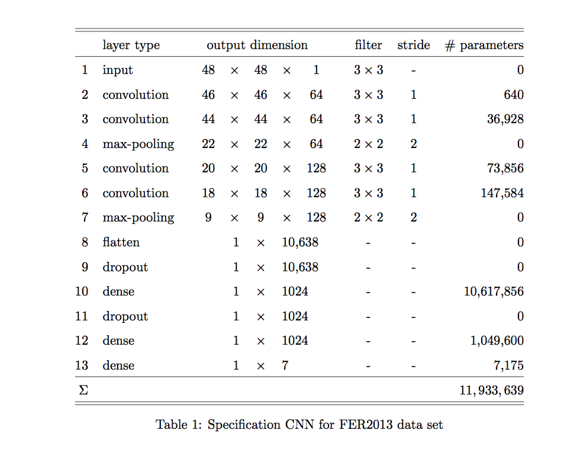

[](http://quantlet.de/)

## [](http://quantlet.de/) **FVCConvNet** [](http://quantlet.de/)

```yaml

Name of Quantlet: FVCConvNet

Published in: Face Value of Companies

Description: 'Fits an Convolutional Neural Network that classifies facial expressions into seven basic emotions (anger, disgust, fear, happiness, neutral, sadness, surprise) using the Keras library for python. The training and testing dataset can be obtained from kaggle''s ''Facial Expression Recognition Challenge''. The subfolder ''model weights'' contains model weights and model architecture in .json-Format. Allows to access the estimation results without rerunning the calculations.'

Keywords: 'neural-network, estimation, empirical, optimization, descending-gradients'

Author: Sophie Burgard

Submitted:  05.11.2017


```





### PYTHON Code
```python

path = '...'

import os
os.chdir(path)
os.getcwd()

import numpy as np
import pandas as pd
import keras
import h5py
from scipy.misc import imread
from sklearn.metrics import accuracy_score
from keras.layers import Input, Convolution2D, MaxPooling2D, Flatten, Dense, InputLayer
from keras.models import model_from_json, Sequential

# To stop potential randomness
seed = 128
rng  = np.random.RandomState(seed)


#load data, requires function load_dataset() from Q-let: FVCload_dataset 
#and original data from Kaggle's Facial Expression Recognition Competition 2013
from FVCload_dataset import load_dataset
(x_train, y_train), (x_test, y_test), (x_valid, y_valid) = load_dataset() 

#reshape data;
#x_train, x_test have inverted names from now on
x_train = x_train.reshape(-1, 48, 48, 1)
x_test  = x_test.reshape(-1, 48, 48, 1)

#normalize
x_train /= 255.0
x_test  /= 255.0

#one-hot-encoding
y_train = keras.utils.np_utils.to_categorical(y_train)
y_test = keras.utils.np_utils.to_categorical(y_test)


# define variables
input_shape   = (2304,)
input_reshape = (48, 48, 1)

#filter sizes
conv_num_filters = 5
conv_filter_size = 5

#pooling size
pool_size = (2, 2)

#number of units
hidden_num_units = 1024
output_num_units = 7

#iterations
epochs = 10

#size of each mini batch
batch_size = 125


#model definition
model = Sequential()

model.add(InputLayer(input_reshape))
model.add(MaxPooling2D(pool_size = (2, 2), strides = None))

model.add(Convolution2D(64, (3, 3), activation='relu'))
model.add(Convolution2D(64, (3, 3), activation='relu'))
#strides: Integer, or None (def). Factor by which to downscale. E.g. 2 will halve the input. 
#If None, it will default to pool_size.
model.add(MaxPooling2D(pool_size = (2,2), strides = None))

model.add(Convolution2D(128, (3, 3), activation='relu'))
model.add(Convolution2D(128, (3, 3), activation='relu'))
model.add(MaxPooling2D(pool_size = (2,2), strides = None))

model.add(Flatten())
#output_dim = units in keras 2 API
model.add(Dense(units = hidden_num_units, activation='relu'))
model.add(Dense(units = hidden_num_units, activation='relu'))

model.add(Dense(units = output_num_units, input_dim = hidden_num_units, activation='softmax'))

model.compile(loss='categorical_crossentropy', optimizer='adam', metrics=['accuracy'])

trained_model_conv = model.fit(x_train, y_train, nb_epoch=epochs, batch_size=batch_size, validation_data=(x_test, y_test))


# serialize model to JSON
model_json = model.to_json()
with open("model_CNN.json", "w") as json_file:
    json_file.write(model_json)
# serialize weights to HDF5
model.save_weights("weights_CNN.h5")
print("Saved model to disk")
 
# for reloading model:
 
# load json and create model
json_file = open('model_CNN.json', 'r')
loaded_model_json = json_file.read()
json_file.close()
loaded_model = model_from_json(loaded_model_json)
# load weights into new model
loaded_model.load_weights("weights_CNN.h5")
print("Loaded model from disk")
 
# evaluate loaded model on test data
loaded_model.compile(loss='categorical_crossentropy', optimizer='adam', metrics=['accuracy'])
score = loaded_model.evaluate(x_train, y_train, verbose=0)
print("%s: %.2f%%" % (loaded_model.metrics_names[1], score[1]*100))


```

automatically created on 2018-05-28