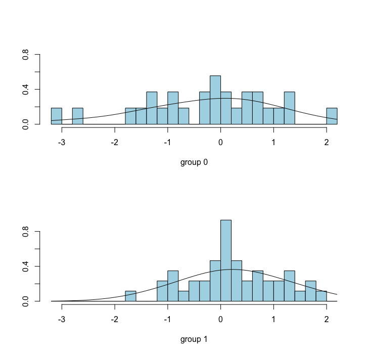

[](http://quantlet.de/)

## [](http://quantlet.de/) **FVCEurostoxxLDA** [](http://quantlet.de/)

```yaml

Name of Quantlet: FVCEurostoxxLDA

Published in: Face Value of Companies

Description: 'Estimates a linear discriminant analysis (LDA) in order to separate positive and negative returns of Eurostoxx50 on press conference days of the European Central Bank based on facial expression scores of the provided video material. Plots resulting histograms and distributions.'


Keywords: 'financial, projection, discriminant-analysis, multivariate, plot, returns'

Author: Sophie Burgard

Submitted:  05.11.2017

Datafile: 'ECB_avg_emo.csv'


```



### R Code
```r

#install required packages if necessary
pkg = c('MASS')
lapply(pkg, require, character.only = TRUE)
lapply(pkg, library, character.only = TRUE)

#set working directory
#setwd(...)

#load data
avg_emo = read.csv2("ECB_avg_emo.csv") 

#chose relevant columns
emodata = avg_emo[,c(2:9,11)]

#binary encoding:
binary          = emodata[,1:8]
binary$ret_dir  = NA

#0 - neg. returns, 1 - pos. returns
binary$ret_dir[emodata[,9] > 0]  = 1
binary$ret_dir[emodata[,9] <= 0] = 0

#redefine as factor-type
binary$ret_dir = as.factor(binary$ret_dir)

#dep. and ind. variables:
x = binary[,c(1:5, 7:8)]
y = binary[,9]

# fit model with bayes-rule
fit_lda = lda(x, y, probMethod = "Bayes")


# make predictions
predictions = predict(fit_lda, x)

# confusion table: pred. vs. true observations
table(predictions$class, y)

#plot histograms and densities
plot(fit_lda, 
     dimen = 1, 
     type  ="both", 
     col   = "lightblue", 
     main  = 'LDA')


```

automatically created on 2018-05-28