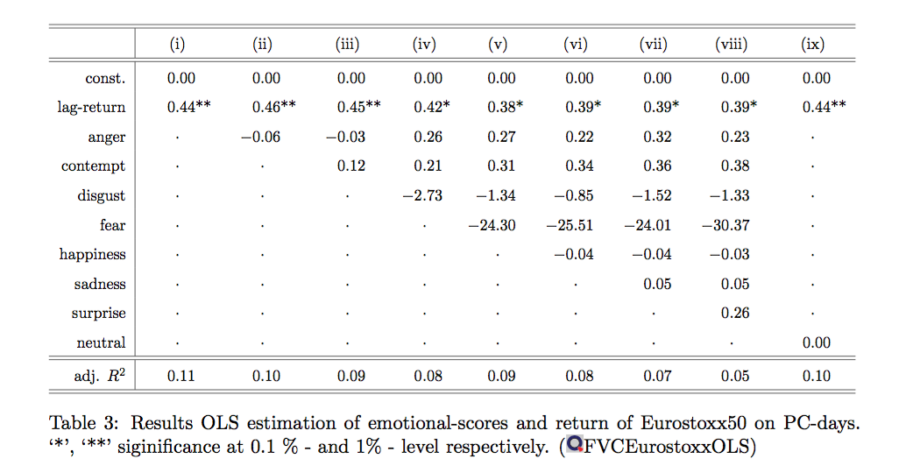

[](http://quantlet.de/)

## [](http://quantlet.de/) **FVCEurostoxxOLS** [](http://quantlet.de/)

```yaml

Name of Quantlet: FVCEurostoxxOLS

Published in: Face Value of Companies

Description: 'Estimates a ordinary least squares models in order to explain returns of Eurostoxx50 on press conference days of the European Central Bank based on facial expression scores of the provided video material.'


Keywords: 'financial, projection, least-squares, multivariate, plot, returns'

Author: Sophie Burgard

Submitted:  05.11.2017

Datafile: 'ECB_avg_emo.csv'


```



### R Code
```r

#set working directory
#setwd(.....)

#read data
data = read.csv2('emo_and_stock_per_pc.csv')


#different models, results displayed in Table 3
fit1 = lm(ret_d0 ~ ret_AR1, data = data)
summary(fit1)

fit2 = lm(ret_d0 ~ ret_AR1 + anger, data = data)
summary(fit2)

fit3 = lm(ret_d0 ~ ret_AR1 + anger + contempt, data = data)
summary(fit3)

fit4 = lm(ret_d0 ~ ret_AR1 + anger + contempt + disgust, data = data)
summary(fit4)

fit5 = lm(ret_d0 ~ ret_AR1 + anger + contempt + disgust + fear, data = data)
summary(fit5)

fit6 = lm(ret_d0 ~ ret_AR1 + anger + contempt + disgust + fear + happiness, data = data)
summary(fit6)

fit7 = lm(ret_d0 ~ ret_AR1 + anger + contempt + disgust + fear + happiness + sadness, data = data)
summary(fit7)

fit8 = lm(ret_d0 ~ ret_AR1 + anger + contempt + disgust + fear + happiness + sadness + surprise, data = data)
summary(fit8)

fit9 = lm(ret_d0 ~ ret_AR1 + neutral, data = data)
summary(fit9)

```

automatically created on 2018-05-28