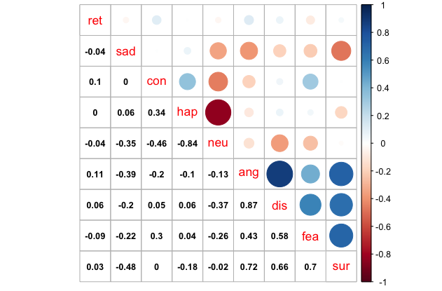
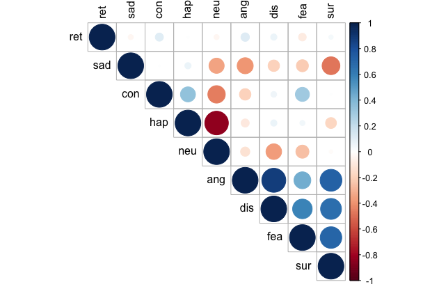

[](http://quantlet.de/)

## [](http://quantlet.de/) **FVCcorr** [](http://quantlet.de/)

```yaml

Name of Quantlet: FVCcorr

Published in: Face Value of Companies

Description: 'Plots the correlation of aggregated emotional scores for 70 ECB press conferences (Jan. 2011 - Sep. 2017) and daily returns of Eurostoxx50 data.'

Keywords: financial, plot, empirical, correlation, visualization, projection

Author: Sophie Burgard

Submitted:  05.11.2017

Datafile: 'ECB_avg_emo.csv'


```





### R Code
```r

set#install required packages if necessary
pkg = c('corrplot')
lapply(pkg, require, character.only = TRUE)
lapply(pkg, library, character.only = TRUE)

#set working directory
#setwd(...)

#load data
avg_emo = read.csv2('ECB_avg_emo.csv') 
emo = avg_emo[,c(2:9,11)]

#rename return variable in dataset
names(emo) = c('ang','con', 'dis', 'fea', 'hap', 'neu', 'sad', 'sur', 'ret')


#generate and round correlation matrix, choose relevant columns
cormat = round(cor(emo), digits = 2)

#generate plot with fct. from 'corrplot'-package

#version with circles and numbers
corrplot.mixed(as.matrix(cormat), lower.col = "black", number.cex = .8, tl.cex = 1.1, , order = "hclust")

#half version
corrplot(cormat, method = "circle", type = 'upper', tl.col = "black", order = "hclust")


```

automatically created on 2018-05-28