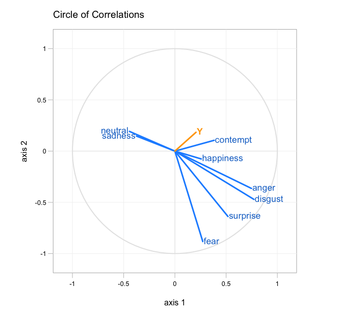

[](http://quantlet.de/)

## [](http://quantlet.de/) **FVCcorrcircle** [](http://quantlet.de/)

```yaml

Name of Quantlet: FVCcorrcircle

Published in: Face Value of Companies

Description: 'Plots the correlation circle of the partial least squares model from Q-let FVCEurostoxxPLS. Dependent variable Y are daily returns of Eurostoxx50 data (Jan. 2011 - Sep. 2017), independent are emotional scores on ECB press conference webcasts (70 observations).'

Keywords: financial, plot, empirical, correlation, visualization, projection

Author: Sophie Burgard

Submitted:  05.11.2017

Datafile: 'ECB_avg_emo.csv'


```



### R Code
```r

#install required packages if necessary
pkg = c('plsdepot')
lapply(pkg, require, character.only = TRUE)
lapply(pkg, library, character.only = TRUE)

#path where dataset is 
dir_data = '...'

#load data
avg_emo = read.csv2(dir_data) 

#sort data, that y-variable is in last position 
emodata = avg_emo[,c(2:9,11)]

#estimate model
pls_fit = plsreg1(emodata[,1:8], emodata[,9], comps = 4, crosval = TRUE)

#plot correlations
## S3 method for class 'plsreg1'
plot(pls_fit, 
    comps = c(1, 2), where = c('t', 't'), cex = 1.1,
    col.xlabels = 'dodgerblue3', 
    col.ylabel = 'orange1',
    yfont = 2, pos = NULL, offset = 0.1,
    col.xarrows = 'dodgerblue1', col.yarrows = 'orange1',
    lwd = 3, length = 0, angle = 0, col.points = 'black',
    pch = 21, pt.bg = 'black', show.names = FALSE,
    xpd = TRUE, xlab = NULL, ylab = NULL, main = NULL,
    col.main = 'black', cex.main = 1.2,
    col.axis = 'black', show.grid = TRUE,
    col.grid = 'gray95' )

```

automatically created on 2018-09-04