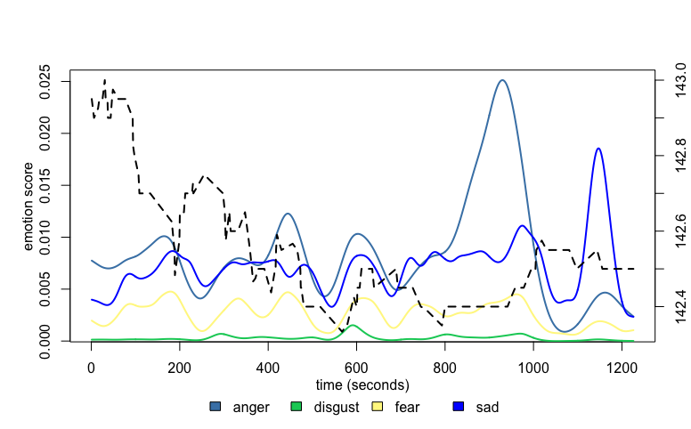
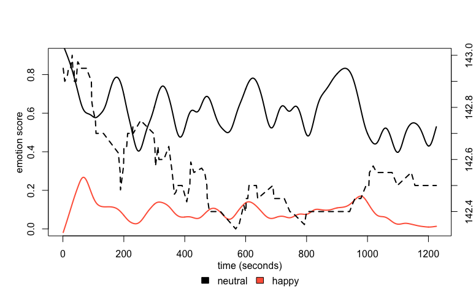

[](http://quantlet.de/)

## [](http://quantlet.de/) **FVCemo_vs_stock** [](http://quantlet.de/)

```yaml

Name of Quantlet: FVCemo_vs_stock

Published in: Face Value of Companies

Description: 'Plots smoothed emo scores (anger, contempt, disgust, fear, surprise, happiness, sadness, neutral, surprise) and stock movement of Volkswagen stock for first 30 minutes of Volkswagen press conference on 05.05.2017.'

Keywords: neural-network, estimation, empirical, financial, plot, visualization

Author: Sophie Burgard

Submitted: 05.11.2017

```





### R Code
```r

library(zoo)

dev.off()
data = read.csv2("vw_0_30_emo_results_per_second.csv", stringsAsFactors = FALSE)
data = data[75:1312,]

#assign right format
data$anger_s     = as.numeric(data$anger_s)  
data$contempt_s  = as.numeric(data$contempt_s)  
data$digust_s    = as.numeric(data$digust_s)  
data$fear_s      = as.numeric(data$fear_s)  
data$happiness_s = as.numeric(data$happiness_s)  
data$neutral_s   = as.numeric(data$neutral_s) 
data$sadness_s   = as.numeric(data$sadness_s)  

#'0' means no emotion-information
#replace with NA
data[data == 0] = NA

#remove NA
data = na.omit(data)


#read and prepare stock data of VW
vw = read.csv2("vw_stock_mean.csv", stringsAsFactors = FALSE)
vw$price = as.numeric(vw$price)
vw$t_sec = as.numeric(vw$t_sec)
vw$t_sec2 = vw$t_sec - 75
set = vw[31:142,]

#x: axis length for smoothing
x    = seq(1,nrow(data))

#smooth lines
ang  = smooth.spline(x, data$anger_s, spar=0.7)
neut = smooth.spline(x, data$neutral_s, spar=0.6)
cont = smooth.spline(x, data$contempt_s, spar=0.6)
disg = smooth.spline(x, data$digust_s, spar=0.6)
fear = smooth.spline(x, data$fear_s, spar=0.6)
happ = smooth.spline(x, data$happiness_s, spar=0.6)
sad  = smooth.spline(x, data$sadness_s, spar=0.6)

#############################################################################
#generate plot for happy and neutral
plot(neut, lwd = 2, type = 'l', xlab = '', ylab = '', ylim = c(0 ,0.9))
lines(happ, col = "tomato1", lwd = 2)

legend("bottom", c("neutral", "happy"), fill = c("black", "tomato1"),
       horiz = TRUE, xpd = TRUE,  inset = c(0, -0.3), bty = "n")

par(new = T)
with(set, plot(set$t_sec, set$price, type = "l", lty = 2, 
    lwd = 2, axes = F, ylab = NA, xlab = NA, cex = 1.2))
axis(side = 4, ylab = "stockprice")
title(xlab="time (seconds)", line = 2, cex.lab = 1,
      ylab="emotion score")
par(bg ="transparent")

#############################################################################       
#plot other emotions

dev.off()
par(bg ="transparent")

plot(ang, col = "steelblue", lwd=2, type = 'l', xlab = '', ylab = '')
lines(disg, col = "khaki1", lwd=2)
lines(fear, col = "springgreen3", lwd=2)
lines(sad, col = "blue", lwd=2)

legend("bottom", c("anger", "disgust", "fear", "sad"), 
       fill = c("steelblue", "springgreen3", "khaki1", "blue"),
       horiz=TRUE, xpd = TRUE,  inset=c(0,-0.3), bty = "n")

par(new = T)
with(set, plot(set$t_sec, set$price, type = "l", lty = 2, lwd = 2, axes=F, ylab =NA, xlab=NA, cex=1.2))
axis(side = 4, ylab = "stockprice")
title(xlab="time (seconds)", line=2, cex.lab=1, ylab="emotion score")
par(bg ="transparent")


```

automatically created on 2018-05-28