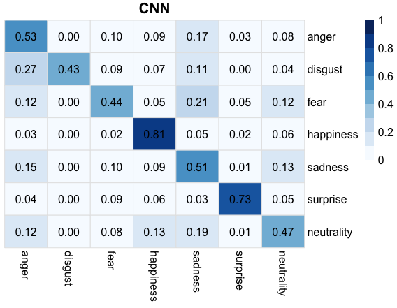
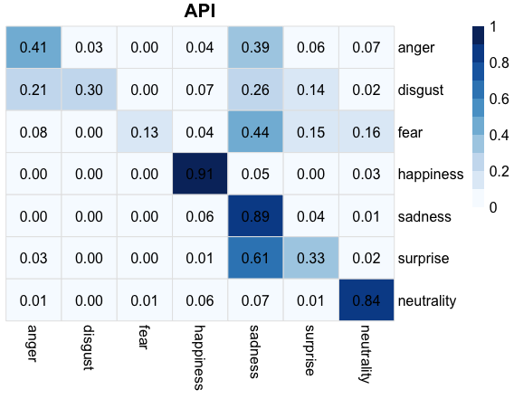
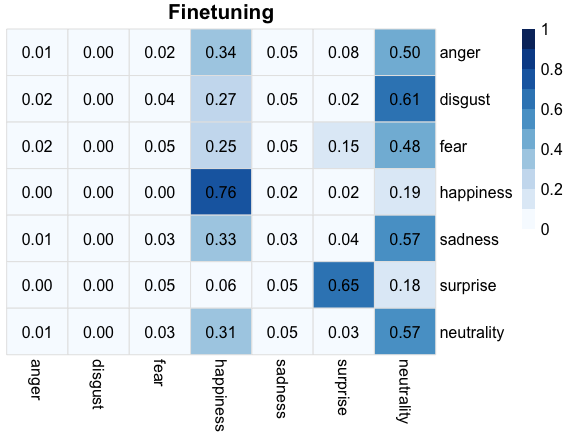

[](http://quantlet.de/)

## [](http://quantlet.de/) **FVCheatmap** [](http://quantlet.de/)

```yaml

Name of Quantlet: FVCheatmap

Published in: Face Value of Companies

Description: "Plots metrics based on confusion matrices generated by FVCconf_CNN, FVCconf_finetune, FVCconf_API to illustrate the accuracy and prediction power of the different models for an intuitive comparison."


Keywords: 'plot, neural-network, estimation, empirical, optimization, descending-gradients'

Author: Sophie Burgard

Submitted: '21.11.2017'


```







### R Code
```r

library('pheatmap')
library('grDevices')
library('RColorBrewer')

cnn  = read.csv('confusion_CNN.csv', stringsAsFactors = FALSE)
cnn  = cnn[,-which(names(cnn) %in% 'X')]
api  = read.csv('confusion_API.csv', stringsAsFactors = FALSE)
api  = api[,-which(names(api) %in% 'X')]
fine = read.csv('confusion_finetune.csv', stringsAsFactors = FALSE)
fine = fine[,-which(names(fine) %in% 'X')]

#functions to replace NaN in dataframe
is.nan.data.frame = function(x)
do.call(cbind, lapply(x, is.nan))
fine[is.nan(fine)] = 0


#function relate calculate for on-diagonal value the positive predictive rate, 
#off-diagonat the false discovery rate
relate = function(x){
    x = as.matrix(x)
    rec = x/rowSums(x)
    return(rec)
}

#round matrix
rel_cnn  = round(relate(cnn), 2)
rel_api  = round(relate(api), 2)
rel_fine = round(relate(fine), 2)

#define color scheme
colramp = colorRampPalette(brewer.pal(9,"Blues"))(10)


#name row and columns
colnames(rel_cnn) = c("anger", "disgust", "fear", "happiness", "sadness", "surprise", "neutrality")
rownames(rel_cnn) = c("anger", "disgust", "fear", "happiness", "sadness", "surprise", "neutrality")

pheatmap(rel_cnn, 
    cluster_rows = F, cluster_cols = F, breaks = seq(0,1,0.1), 
    treeheight_row = F, color = colramp, annotation_names_row = TRUE, 
    annotation_names_col = TRUE, show_colnames = TRUE, show_rownames = TRUE,
    main = "CNN", cex.main=1.2, display_numbers = TRUE, fontsize= 12,
    fontsize_number = 12, number_color = 'black', border_color = 'grey90')


colnames(rel_api) = c("anger", "disgust", "fear", "happiness", "sadness", "surprise", "neutrality")
rownames(rel_api) = c("anger", "disgust", "fear", "happiness", "sadness", "surprise", "neutrality")

pheatmap(rel_api, 
    cluster_rows = F, cluster_cols = F, breaks = seq(0,1,0.1), 
    treeheight_row = F, color = colramp, annotation_names_row = TRUE, 
    annotation_names_col = TRUE, show_colnames = TRUE, show_rownames = TRUE,
    main= "API", cex.main=1.2, display_numbers = TRUE, fontsize= 12, fontsize_number = 12, 
    number_color = 'black', border_color = 'grey90')


colnames(rel_fine) = c("anger", "disgust", "fear", "happiness", "sadness", "surprise", "neutrality")
rownames(rel_fine) = c("anger", "disgust", "fear", "happiness", "sadness", "surprise", "neutrality")

pheatmap(rel_fine, cluster_rows = F, cluster_cols = F, breaks = seq(0,1,0.1), 
    treeheight_row = F, color = colramp, annotation_names_row = TRUE, 
    annotation_names_col = TRUE, show_colnames = TRUE, show_rownames = TRUE,
    main = "Finetuning", cex.main=1.2, display_numbers = TRUE, fontsize= 12, fontsize_number = 12, 
    number_color = 'black', border_color = 'grey90')

```

automatically created on 2018-09-04