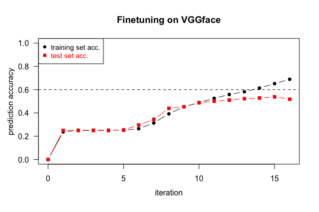
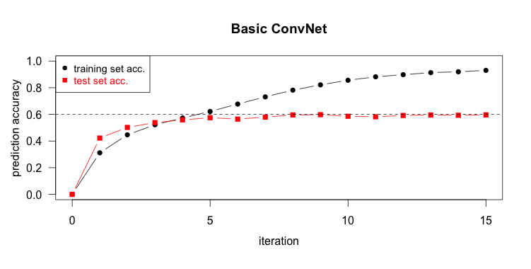

[](http://quantlet.de/)

## [](http://quantlet.de/) **FVCperformancePlot** [](http://quantlet.de/)

```yaml

Name of Quantlet: FVCperformancePlot

Published in: Face Value of Companies

Description: 'Plots accuracy of FVCConvNet and FVCConvNetFinetune 
on identical training and validation set for each iteration of estimation'

Keywords: neural-network, estimation, empirical, optimization, descending-gradients, plot

Author: Sophie Burgard

Submitted: 05.11.2017


```



