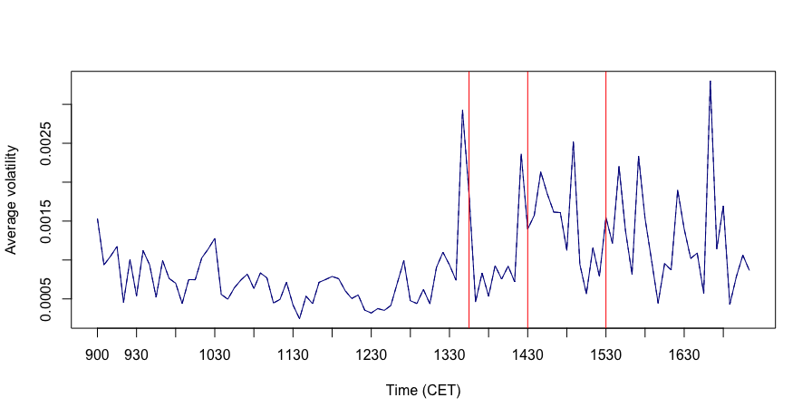

[](http://quantlet.de/)

## [](http://quantlet.de/) **FVCpressdays** [](http://quantlet.de/)

```yaml

Name of Quantlet: FVCpressdays

Published in: Face Value of Companies

Description: 'Plots the volatility of DAX30 index on days where the European Central Bank is holding press conferences vs. all other days between January 2015 until September 2017. Volatilities are averaged for each group and estimated from the data, based on 5 minute data. Vertical lines indicate the press release by European central bank council at 13.45, the beginning of the press conference at 14.30, held by the president, and the approximate end at 15.30.'

Keywords: financial, plot, empirical, volatility, visualization

Author: Sophie Burgard

Submitted:  05.11.2017

Datafile: 'DAX_all_days_aggregate.csv, DAX_press_days_aggregate.csv'


```



### R Code
```r

#load and install required packages

pkg = c('plyr', 'TTR')
lapply(pkg, require, character.only = TRUE)
lapply(pkg, library, character.only = TRUE)

#open data sets, set working directory if necessary
#setwd(...)
dax_all_days   = read.csv2('DAX_all_days_aggregate.csv')
dax_press_days = read.csv2('DAX_press_days_aggregate.csv')

#delete old graphic device
dev.off()

#generate plot
plot(dax_press_days$time, dax_press_days$sd, 
     type = 'l', 
     axes = FALSE, 
     xlab = 'Time (CET)', 
     ylab = 'Average volatility', 
     col  = 'darkblue', 
     lwd  = 1)

#transparent background
par(bg = NA)

#box around plot
box(which = 'plot', lty = 'solid')

#ticks and labels
axis(side = 1, at =seq(1, 101, 6), labels = as.character(dax_press_days$time2[seq(1, 101, 6)]))
axis(side = 2, labels = TRUE)

#add vertical lines at 13:45, 14:30, 15:30
lines(dax_all_days$sd, type='l', lty = 2, col = 'darkblue', lwd = 1)
abline(v = c(58,67, 79), col = 'red')
par(bg = NA)


```

automatically created on 2018-05-28